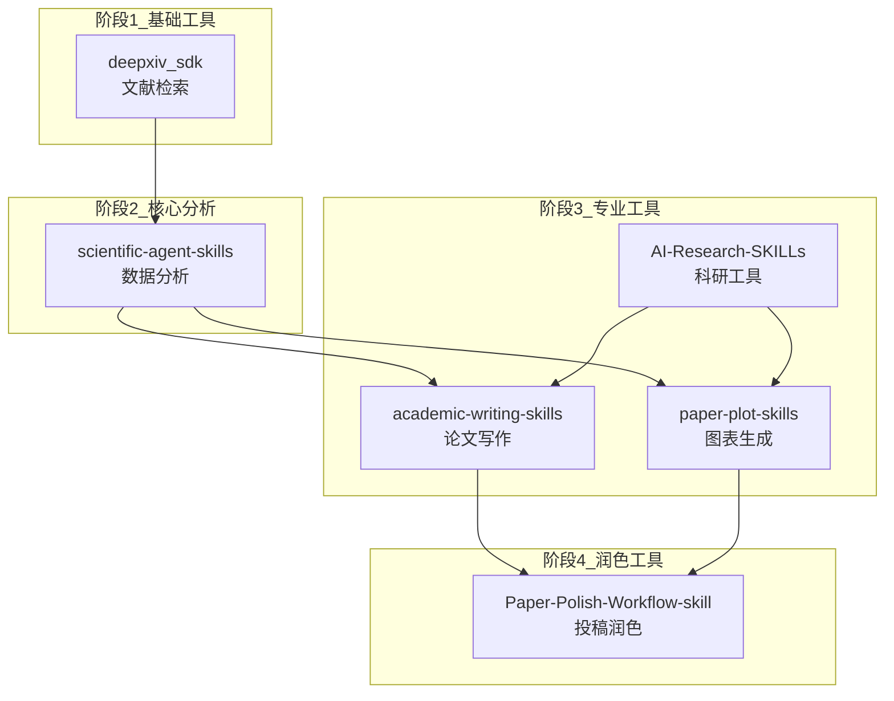
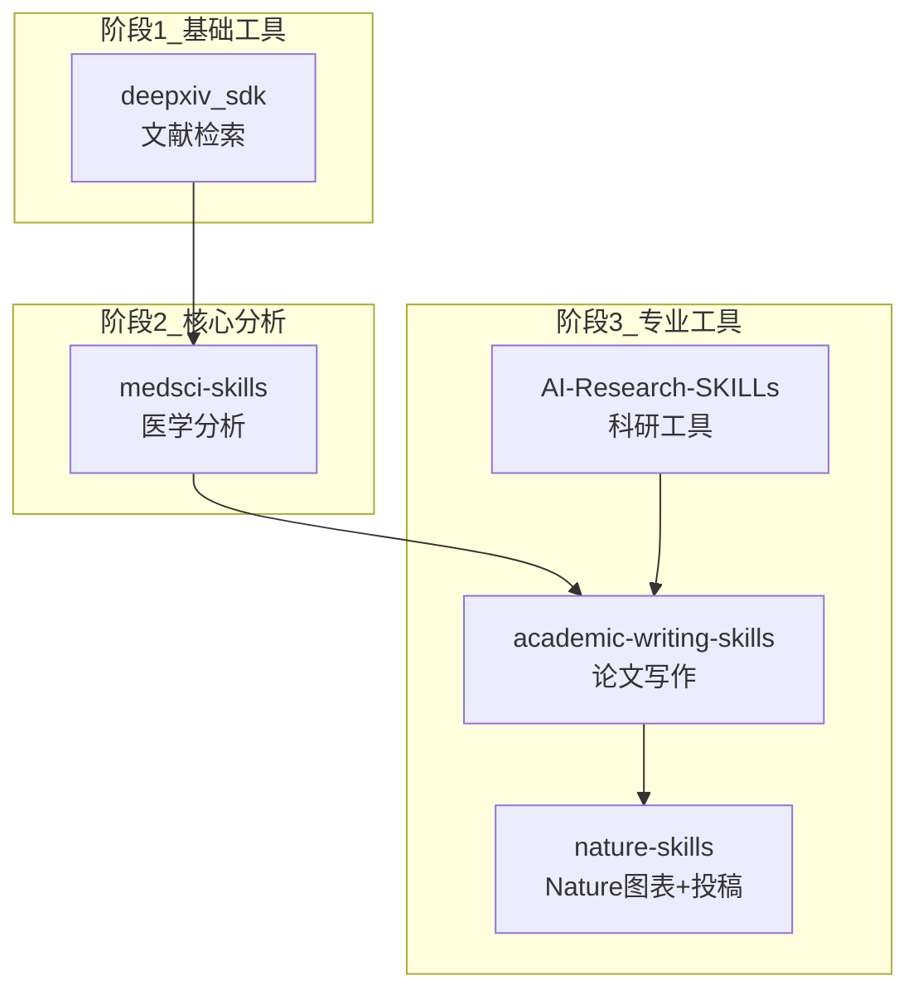
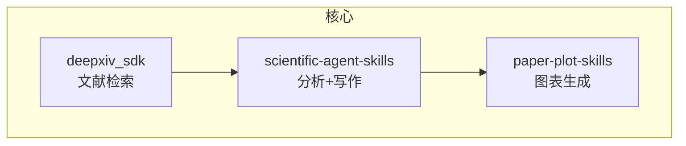

# 03-INSTALL-ORDER: 安装顺序和依赖图

**Generated:** 2026-05-11
**Source:** 03-CONFLICTS.md, 03-COMBINATIONS.md

---

## 安装顺序原则

1. **基础工具优先:** 通用的、依赖少的skill先安装
2. **专业工具次之:** 特定领域的skill后安装
3. **避免互斥:** 不同时安装冲突的skill
4. **依赖关系:** A依赖B时，B先安装

---

## 推荐安装顺序（方案A: 核心团队）

### Topological Sort

```
阶段1: 基础工具
  └─ deepxiv_sdk (文献检索基础)

阶段2: 核心分析
  └─ scientific-agent-skills (数据分析核心)

阶段3: 专业工具
  ├─ academic-writing-skills (论文写作)
  ├─ paper-plot-skills (图表生成)
  └─ AI-Research-SKILLs (科研工具增强)

阶段4: 润色工具
  └─ Paper-Polish-Workflow-skill (投稿润色)
```

### 安装命令（参考）

```bash
# 阶段1: 基础工具
claude skill install deepxiv_sdk

# 阶段2: 核心分析
claude skill install scientific-agent-skills

# 阶段3: 专业工具
claude skill install academic-writing-skills
claude skill install paper-plot-skills
claude skill install AI-Research-SKILLs

# 阶段4: 润色工具
claude skill install Paper-Polish-Workflow-skill
```

---

## Mermaid依赖图

### 方案A: 核心团队依赖图



### 方案B: 医学专项依赖图



### 方案C: 精简版依赖图



---

## 安装顺序冲突解决

### 冲突1: scientify vs scientific-agent-skills

**冲突:** 都是通用分析，可能同时被引用

**解决:** 方案A优先scientific-agent-skills

### 冲突2: paper-plot-skills vs nature-skills

**冲突:** 都做图表生成，功能重叠

**解决:** 方案A用paper-plot-skills，方案B用nature-skills

### 冲突3: deepxiv_sdk vs ARIS

**冲突:** 都做文献检索

**解决:** 可同时安装（专注不同：阅读体验 vs 全流程）

---

## 推荐的安装流程总结

### 首次安装流程

1. **deepxiv_sdk** - 文献检索基础
2. **scientific-agent-skills** - 数据分析核心
3. **academic-writing-skills** - 论文写作
4. **paper-plot-skills** - 图表生成
5. **AI-Research-SKILLs** - 科研工具增强
6. **Paper-Polish-Workflow-skill** - 投稿润色

### 医学研究补充

- 用 **medsci-skills** 替换 scientific-agent-skills
- 用 **nature-skills** 替换 paper-plot-skills

### 精简版

- 仅安装 scientific-agent-skills + deepxiv_sdk + paper-plot-skills
