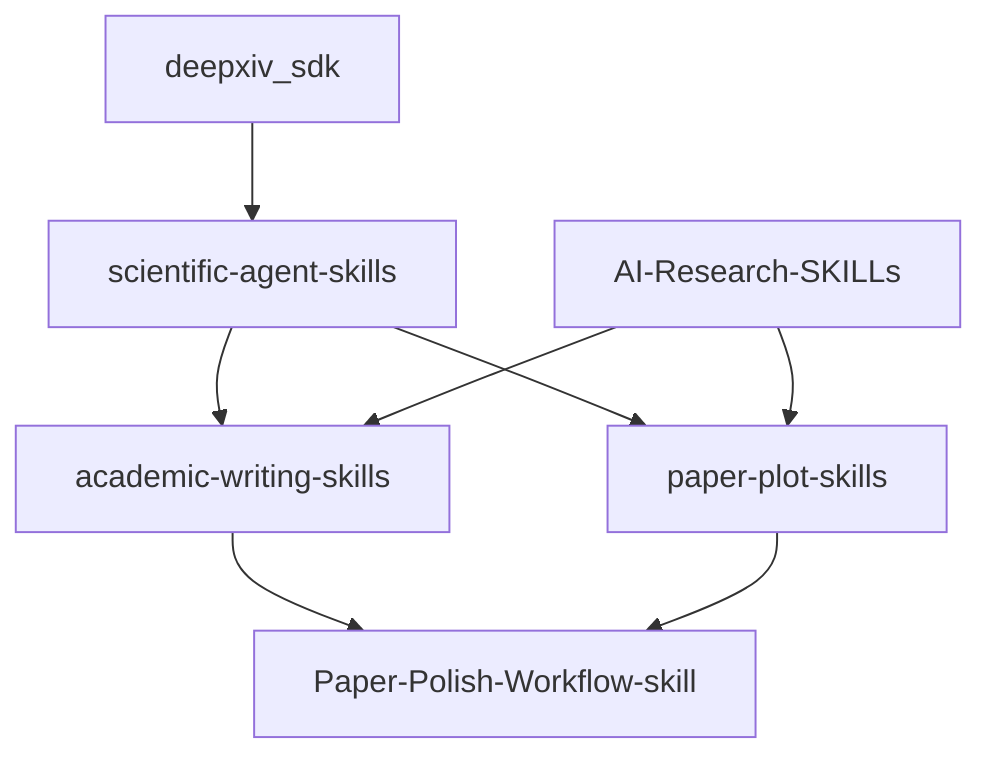

# Phase 3 组合分析 - 执行总结

**Phase:** 3-组合分析
**Generated:** 2026-05-11
**Status:** ✓ Complete

---

## 执行摘要

Phase 3对Phase 2评测的39个仓库进行组合分析，输出：
- 互补/冗余矩阵（7个功能类别）
- 角色化精简组合方案（3种）
- 互斥检测结果
- 安装顺序建议和Mermaid依赖图

---

## 关键发现

### 1. 互补分析

**7个功能类别:**
| 类别 | 数量 | 核心skill |
|------|------|-----------|
| 文献检索类 | 7 | deepxiv_sdk |
| 学术写作类 | 6 | academic-writing-skills |
| 数据分析类 | 5 | scientific-agent-skills |
| 图表生成类 | 4 | paper-plot-skills |
| 引用管理类 | 3 | yy/claude-scholar |
| 科研工具类 | 4 | AI-Research-SKILLs |
| 医学研究类 | 4 | medsci-skills |

**高度互补对:**
- deepxiv_sdk + ARIS（检索+全流程）
- academic-writing-skills + Paper-Polish（写作+润色）
- scientific-agent-skills + medsci-skills（通用+医学专项）

### 2. 冗余检测

**应排除（2个）:**
| Skill | 原因 |
|-------|------|
| research-workflow-assistant | 深度3.0，与everything-claude-code差距1.5 |
| nicholash84/Claude-Scientific-Skills | 信息有限，深度存疑 |

**应降级（5个）:**
| Skill | 原因 |
|-------|------|
| scientify | 与scientific-agent-skills功能高度重叠 |
| openalex-research-mcp | 与引用管理类skill功能重叠 |
| beita6969/ScienceClaw | fork版本，有同步风险 |

### 3. 角色化组合方案

**方案A: 核心团队（6个）**
- deepxiv_sdk + scientific-agent-skills + academic-writing-skills + paper-plot-skills + Paper-Polish-Workflow-skill + AI-Research-SKILLs
- 平均DepthScore: 4.17
- 覆盖完整科研流程

**方案B: 医学专项（5个）**
- deepxiv_sdk + medsci-skills + academic-writing-skills + nature-skills + AI-Research-SKILLs
- 平均DepthScore: 4.1
- PRISMA/STROBE合规

**方案C: 精简版（3个）**
- scientific-agent-skills + deepxiv_sdk + paper-plot-skills
- 平均DepthScore: 4.17
- 最少安装，最快启动

### 4. 互斥检测

**硬互斥（不可同时安装）:**
- research-workflow-assistant + everything-claude-code
- nicholash84 + academic-writing-skills

**软互斥（二选一）:**
- scientify OR scientific-agent-skills
- paper-plot-skills OR nature-skills
- deepxiv_sdk OR ARIS

---

## Mermaid依赖图

### 方案A: 核心团队

---

## 安装顺序

1. deepxiv_sdk（基础检索）
2. scientific-agent-skills（核心分析）
3. academic-writing-skills + paper-plot-skills + AI-Research-SKILLs（专业工具）
4. Paper-Polish-Workflow-skill（润色）

---

## 下一步建议

1. **安装推荐组合:** 方案A或方案B
2. **排除列表:** research-workflow-assistant, nicholash84/Claude-Scientific-Skills
3. **二选一原则:** scientify/scientific-agent-skills, paper-plot-skills/nature-skills
4. **Phase 4准备:** 验证推荐组合的实际效果

---

## 生成文件清单

| 文件 | 内容 |
|------|------|
| 03-CONTEXT.md | 用户决策（来自discuss-phase） |
| 03-MATRIX-GROUPS.md | 功能类别分组（7个类别） |
| 03-COMPLEMENTARITY-MATRIX.md | 互补矩阵 |
| 03-REDUNDANCY-REPORT.md | 冗余检测报告 |
| 03-MATRIX.md | 综合矩阵文档 |
| 03-ROLES.md | 角色化定义（6个角色） |
| 03-COMBINATIONS.md | 组合方案（3种） |
| 03-CONFLICTS.md | 互斥检测报告 |
| 03-INSTALL-ORDER.md | 安装顺序+Mermaid图 |

---

*Summary generated: 2026-05-11*
*Source: Phase 2 evaluation + Phase 3 analysis*
