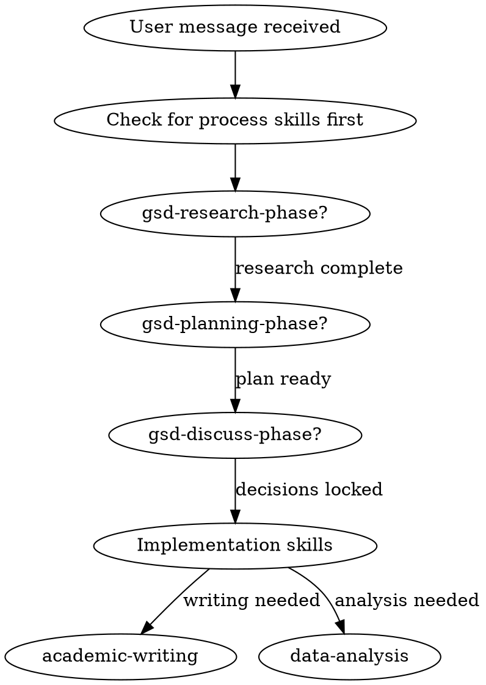

# Phase 05-02: Superpowers结构研究

**Researched:** 2026-05-12
**Domain:** Claude Code插件结构模式
**Confidence:** HIGH

## Summary

Superpowers是一个完整的方法论插件，通过skills系统实现软件开发流程的自动化。其核心价值在于：将专业开发方法论（TDD、代码审查、迭代开发）封装为可自动触发的skill，使AI Agent在正确时机执行正确动作。

关键发现：
1. **SKILL.md描述触发机制**：每个skill通过YAML front matter中的`description`字段定义触发条件，description是AI判断是否需要使用该skill的主要依据
2. **Session Start Hook注入能力**：通过hooks系统在session启动时注入using-superpowers skill，确保Agent首先检查是否有适用的skill
3. **子skill协作模式**：skills之间通过`<SUBAGENT-STOP>`标签和"REQUIRED SUB-SKILL"声明建立依赖关系，形成工作流链
4. **多层模板支持**：复杂skill包含prompt模板（implementer-prompt.md）、技术参考（visual-companion.md）、检查清单等辅助文件

## Architectural Responsibility Map

| Capability | Primary Tier | Secondary Tier | Rationale |
|------------|-------------|----------------|-----------|
| Skill触发判断 | Agent (运行时) | — | AI根据description判断 |
| 工作流编排 | Skill (CLAUDE.md) | Hook (session-start) | Hook注入初始化能力 |
| 任务执行 | Subagent (per task) | Controller (主session) | 隔离context防止污染 |
| 审查验证 | Reviewer subagent | 代码质量检查 | 两阶段review机制 |

## 1. Superpowers结构模式

### 1.1 插件目录结构

```
superpowers/5.1.0/
├── .claude-plugin/          # 插件元数据
│   ├── plugin.json           # 插件描述（name, version, author）
│   └── marketplace.json      # 市场发布配置
├── skills/                   # 技能库（14个skill）
│   ├── brainstorming/
│   │   ├── SKILL.md          # 主文件（触发条件+行为描述）
│   │   ├── visual-companion.md
│   │   └── scripts/
│   ├── subagent-driven-development/
│   │   ├── SKILL.md
│   │   ├── implementer-prompt.md      # 子agent模板
│   │   ├── spec-reviewer-prompt.md
│   │   └── code-quality-reviewer-prompt.md
│   ├── writing-plans/
│   ├── test-driven-development/
│   └── ... (13个skills)
├── hooks/                    # Session hooks
│   ├── hooks.json            # Hook配置
│   ├── session-start         # 启动时执行的脚本
│   └── run-hook.cmd          # Hook runner
├── CLAUDE.md                 # 主指令文件（贡献者指南）
└── README.md                 # 用户文档
```

### 1.2 SKILL.md结构（标准模式）

```yaml
---
name: <skill-name>                    # 唯一标识，用于invoke
description: "<触发条件描述>"          # AI判断是否触发的依据
---

# Skill Title

## Overview
[技能目的]

## When to Use
[使用时机，与description互补]

## The Process
[详细步骤]

## Integration
**Required workflow skills:**
- **superpowers:<dep-skill>** - [依赖说明]

<可选：SUBAGENT-STOP标签>
<可选：HARD-GATE强门标签>
```

**触发机制核心**：
- `description`字段是自动触发的关键：简洁描述使用场景
- 例如：`"Use when you have a spec or requirements for a multi-step task, before touching code"`
- AI在收到用户消息时，评估description是否匹配，选择性invoke skill

### 1.3 Hook触发机制

**hooks/session-start** 在每次session启动时执行：
1. 读取`skills/using-superpowers/SKILL.md`内容
2. 通过JSON注入`additionalContext`
3. Agent收到消息后首先激活using-superpowers skill
4. 该skill包含skill检查流程，触发其他skills

**流程图**：
```
Session Start → Hook读取using-superpowers → 注入additionalContext →
Agent首条消息 → 激活using-superpowers → 检查所有skill description →
匹配时自动invoke
```

### 1.4 能力边界定义

| 边界类型 | 示例 | 机制 |
|---------|------|------|
| 硬门（HARD-GATE） | `<HARD-GATE>Do NOT write code until design approved</HARD-GATE>` | 强阻塞，必须完成前置步骤 |
| 子agent停止 | `<SUBAGENT-STOP>` | 被dispatch的subagent不执行该skill |
| 条件分支 | `When to Use` / `Prerequisites` | 描述使用前置条件 |
| 流程终点 | `REQUIRED SUB-SKILL` | 当前skill完成后必须invoke下一个skill |

### 1.5 依赖关系模式

**水平依赖**（同层skills）：
- `brainstorming` → `writing-plans`（设计完成后制定计划）
- `subagent-driven-development` → `finishing-a-development-branch`（执行完成后收尾）

**垂直依赖**（主从关系）：
- `subagent-driven-development` 依赖多个子prompt：
  - `implementer-prompt.md`（实施者）
  - `spec-reviewer-prompt.md`（规格审查）
  - `code-quality-reviewer-prompt.md`（质量审查）

**引用语法**：
```markdown
**REQUIRED SUB-SKILL:** Use superpowers:subagent-driven-development
Use `skill:using-superpowers` to check available skills
```

### 1.6 Trigger优先级

1. **Session Start Hook**：最先注入，确保skill系统可用
2. **using-superpowers**：检查所有skill description匹配
3. **Process skills**（brainstorming, debugging）优先于Implementation skills
4. **用户指令覆盖**：CLAUDE.md显式指令优先于skill行为

## 2. 建议的Scientific-Skills结构

### 2.1 插件结构

```
scientific-skills/
├── .claude-plugin/
│   ├── plugin.json           # name: scientific-skills
│   └── marketplace.json
├── skills/
│   ├── gsd-research-phase/   # 科研方法论核心
│   │   ├── SKILL.md
│   │   ├── thinking-models.md
│   │   └── verification-protocols.md
│   ├── gsd-planning-phase/
│   ├── gsd-discuss-phase/
│   ├── gsd-execute-phase/
│   ├── academic-writing/     # 领域技能
│   │   ├── SKILL.md
│   │   └── paper-structure.md
│   ├── data-analysis/
│   ├── visualization/
│   └── literature-review/
├── hooks/
│   ├── hooks.json
│   └── session-start         # 注入gsd-init
├── CLAUDE.md                 # 科研工作流说明
└── README.md
```

### 2.2 核心skill设计（Phase 4决策已确定）

**7个核心skill**（按工作流顺序）：
1. `deepxiv_sdk` - 文献调研
2. `scientific-agent-skills` - 研究方法论
3. `academic-writing-skills` - 论文写作
4. `paper-plot-skills` - 图表制作
5. `Paper-Polish-Workflow-skill` - 论文润色
6. `medsci-skills` - 医学领域
7. `everything-claude-code` - 开发助手

**3个扩展skill**：
- `nature-skills`
- `claude-scholar`
- `scientify`

**1+N模式**：1个核心能力包 + N个扩展包

### 2.3 SKILL.md模板（科研skill）

```yaml
---
name: <skill-name>
description: "<触发条件 - 科研场景>"
---

# <Skill Title>

## Overview
[技能目的和研究价值]

## When to Use
[科研工作流中的使用时机]

## Process
[具体步骤，与GSD框架对齐]

## Integration
**Phase workflow:**
- **Phase:** [GSD phase number]
- **Triggers:** [什么情况下invoke此skill]

**Related skills:**
- **scientific-skills:<related>** - [关系说明]
```

## 3. 触发条件草案

### 3.1 科研工作流触发条件

| Skill | Trigger Description | 优先级 |
|-------|---------------------|--------|
| gsd-research-phase | "Use when starting a new research phase, investigating a topic, or needing to understand domain before planning" | 1 |
| gsd-planning-phase | "Use when research is complete and you need to create implementation plan" | 2 |
| gsd-discuss-phase | "Use when making key decisions, resolving ambiguity, or confirming approach with user" | 2 |
| gsd-execute-phase | "Use when executing planned tasks, implementing research findings" | 3 |
| academic-writing | "Use when writing research papers, academic documents, or preparing publications" | 3 |
| literature-review | "Use when reviewing existing literature, comparing approaches, or surveying related work" | 2 |
| visualization | "Use when creating figures, charts, or visual representations of research data" | 4 |

### 3.2 触发优先级策略



## 4. 能力边界草案

### 4.1 硬门定义（HARD-GATE）

| 边界 | 条件 | 要求 |
|------|------|------|
| 规划前研究 | REQ not in existing knowledge | 必须执行research phase |
| 写作前设计 | Writing complex academic document | 必须完成design/structure |
| 实现前确认 | Key implementation decisions | 必须通过discuss-phase |

### 4.2 条件触发

| 条件 | Skill | 行为 |
|------|-------|------|
| 新领域 | Any domain not in existing skills | Invoke research phase |
| 学术写作 | Writing papers, theses, proposals | Invoke academic-writing |
| 图表需求 | Data + visualization request | Invoke visualization |

### 4.3 排除条件

| 排除场景 | 原因 | 处理 |
|----------|------|------|
| 简单问答 | 不涉及research/planning | 直接回答 |
| 已有方案 | 不需要新research | 使用现有skills |
| 用户明确指示 | 跳过标准流程 | 遵循用户指令 |

## 5. 依赖关系草案

### 5.1 Skill依赖图

```
                    ┌─────────────┐
                    │  research   │
                    │   phase     │
                    └──────┬──────┘
                           │
                    ┌──────▼──────┐
                    │   planning   │
                    │    phase    │
                    └──────┬──────┘
                           │
              ┌────────────┼────────────┐
              │            │            │
       ┌──────▼─────┐ ┌────▼────┐ ┌──────▼──────┐
       │  discuss   │ │execute  │ │  execute    │
       │   phase   │ │ phase   │ │  (detail)   │
       └──────┬─────┘ └────┬────┘ └─────────────┘
              │            │
              │      ┌──────▼──────┐
              │      │  academic   │
              │      │  writing    │
              │      └──────┬──────┘
              │            │
              └──────┬─────┘
                     │
              ┌──────▼──────┐
              │  polishing  │
              │  workflow   │
              └─────────────┘
```

### 5.2 依赖声明

**Phase间依赖**：
- planning-phase requires research-phase output
- discuss-phase handles decisions before planning
- execute-phase follows planning
- academic-writing follows execution

**Cross-cutting依赖**：
- 所有skills依赖gsd-init作为入口
- visualization依赖data-analysis结果

### 5.3 协作模式

**顺序协作**（Phase工作流）：
```markdown
## Integration
**Required workflow skills:**
- **scientific-skills:gsd-research-phase** - Must complete before planning
- **scientific-skills:gsd-planning-phase** - Follows research
```

**并行协作**（领域skill）：
```markdown
## Integration
**Optional enhancements:**
- **scientific-skills:visualization** - For figure generation
- **scientific-skills:literature-review** - For related work comparison
```

## 6. Superpowers可复用模式总结

| 模式 | Superpowers实现 | 科研Skill建议 |
|------|-----------------|--------------|
| 描述触发 | description字段 | 明确的科研场景描述 |
| Session初始化 | Hook注入 | 科研workflow引导 |
| 流程链 | REQUIRED SUB-SKILL | Phase间顺序 |
| 审查机制 | 两阶段review | 质量检查点 |
| 模板支持 | prompt templates | 领域模板 |
| 硬门控制 | HARD-GATE | 关键决策点 |

## 7. Open Questions

1. **扩展skill优先级**：当核心skill和扩展skill都匹配时，优先使用哪个？
2. **跨领域触发**：医学+统计场景，多个domain skill如何协调？
3. **用户干预时机**：科研场景中，哪些节点需要human-in-loop？

## Sources

### Primary (HIGH confidence)
- superpowers/5.1.0/skills/*/SKILL.md - 14个skill的完整结构
- superpowers/5.1.0/hooks/session-start - Hook触发机制
- superpowers/5.1.0/.claude-plugin/plugin.json - 插件元数据格式

### Secondary (MEDIUM confidence)
- CLAUDE.md - 贡献者指南中的skill设计哲学
- README.md - 使用文档

## Metadata

**Confidence breakdown:**
- 结构模式: HIGH - 直接读取源码验证
- 触发机制: HIGH - Hook源码可验证
- 设计建议: MEDIUM - 基于patterns推断，需实践验证

**Research date:** 2026-05-12
**Valid until:** 2026-06-12 (插件结构相对稳定)